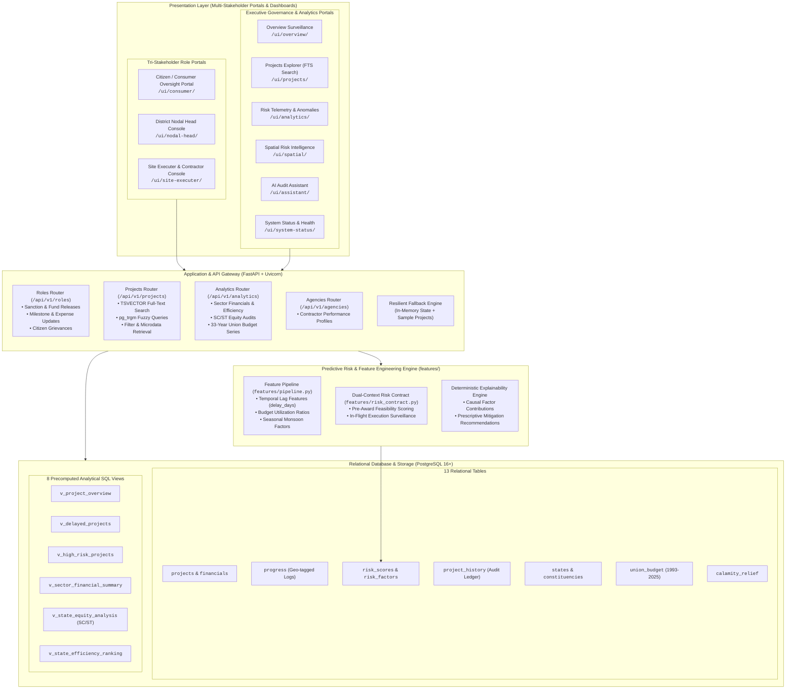
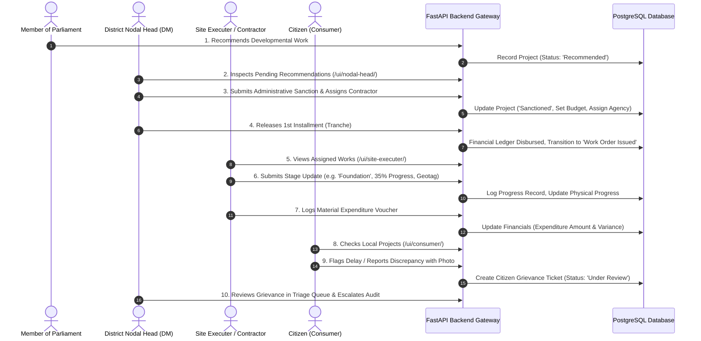
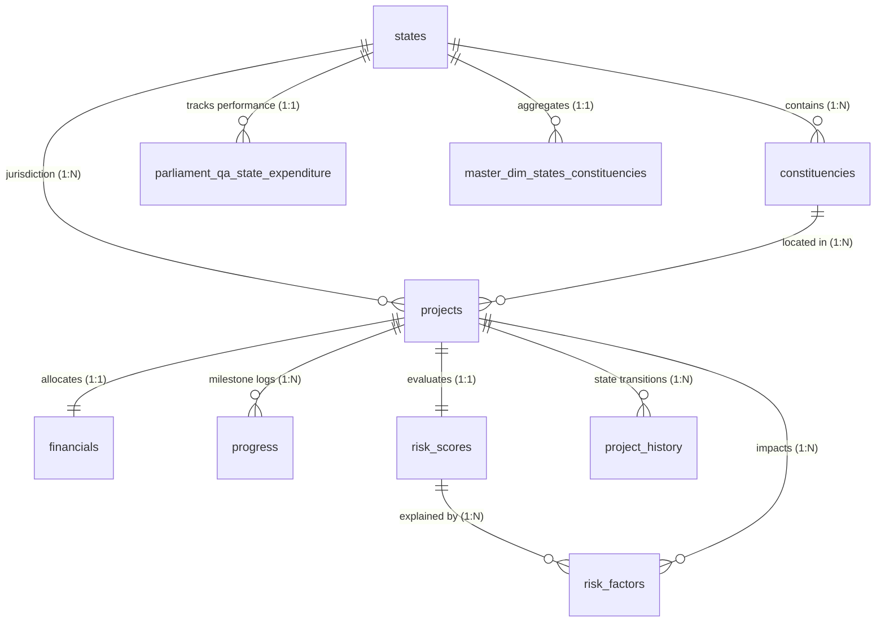

# MPLADS Sentinel: AI-Powered Public Fund Intelligence, Surveillance & Multi-Stakeholder Governance Platform
**Smart India Hackathon (SIH) 2026**  
**Ministry / Domain**: Ministry of Statistics and Programme Implementation (MoSPI) – Member of Parliament Local Area Development Scheme (MPLADS)  
**Database**: PostgreSQL 16+ with `pg_trgm`, GIN & Full-Text Search (`TSVECTOR`)  
**Backend**: FastAPI (Python 3.12), SQLAlchemy 2.0, Pydantic v2, Uvicorn  
**Frontend**: Multi-Stakeholder Responsive Web Portals & Executive Governance Dashboards  
**Repository**: [https://github.com/Bhv1122/mplads-sentinel-sih-2026](https://github.com/Bhv1122/mplads-sentinel-sih-2026)  
**Status**: Production Release (100% Relational Integrity, 63/63 Audit Checks Passed, Full Multi-Stakeholder Portals Integrated)

---

## Table of Contents
1. [Executive Summary & Problem Statement](#1-executive-summary--problem-statement)
2. [End-to-End System Architecture](#2-end-to-end-system-architecture)
3. [Tri-Stakeholder Portals & Operational Workflows](#3-tri-stakeholder-portals--operational-workflows)
4. [Executive Dashboards & Surveillance Portals](#4-executive-dashboards--surveillance-portals)
5. [Backend API Gateway Architecture](#5-backend-api-gateway-architecture)
6. [Predictive ML Risk Engine & Feature Contract](#6-predictive-ml-risk-engine--feature-contract)
7. [PostgreSQL Relational Database Schema](#7-postgresql-relational-database-schema)
8. [Data Ingestion, Quality & Auditing Pipelines](#8-data-ingestion-quality--auditing-pipelines)
9. [Project Directory Layout](#9-project-directory-layout)
10. [Installation, Setup & Local Deployment](#10-installation-setup--local-deployment)
11. [Verification, Benchmarks & Validation Scorecard](#11-verification-benchmarks--validation-scorecard)

---

## 1. Executive Summary & Problem Statement

### The Problem
The **Member of Parliament Local Area Development Scheme (MPLADS)** entitles each Member of Parliament (MP) to recommend development projects worth ₹5 Crore annually, aimed at creating durable community infrastructure (drinking water, primary healthcare, school sanitation, rural connectivity, and disaster relief). However, national monitoring has historically faced critical structural obstacles:
1. **Opaque Execution & Communication Silos**: Disconnect between recommendations made by MPs, administrative sanctions issued by District Authorities, field execution by local contractors, and the citizens who use the infrastructure.
2. **Chronic Schedule Slippage & Stalled Works**: Thousands of projects linger uncompleted for years without automated escalation mechanisms.
3. **Fiscal Leakage & Delayed Disbursements**: Unspent balances accumulate in state treasury accounts, and funds are disbursed without real-time milestone verification.
4. **Lack of Civic Feedback Loops**: Citizens have no direct, tamper-proof mechanism to verify on-the-ground progress or report ghost works and substandard construction.

### The Solution: MPLADS Sentinel
**MPLADS Sentinel** is a complete, full-stack governance intelligence and surveillance platform that turns static administrative data into actionable operational oversight. It connects all three key stakeholders through synchronized check-and-edit workflows:
- **Citizens (Consumers)** inspect verified project microdata, view geotagged photos, and report anomalies directly to district magistrates.
- **District Nodal Heads (Collectors / DMs)** review recommendations, grant statutory sanctions, disburse tranches, and triage civic grievances.
- **Site Executers (Contractors / Field Engineers)** log stage transitions (Earthwork $\to$ Foundation $\to$ Finishing $\to$ Handover), upload GPS-tagged evidence, and record expenditure vouchers.
- **MoSPI & National Executives** access high-level risk heatmaps, predictive delay forecasting, and 33-year Union Budget compliance intelligence.

---

## 2. End-to-End System Architecture



---

## 3. Tri-Stakeholder Portals & Operational Workflows

The platform introduces specialized interfaces for all three operational tiers of the scheme. Each portal provides a dedicated **Check** (surveillance/monitoring) and **Edit** (transactional update) workflow:



### A. Citizen / Consumer Oversight Portal (`/ui/consumer/`)
- **Target Audience**: General public, civic journalists, community beneficiaries, RTI activists.
- **Check Workflow**:
  - Live search by project title, work code, constituency, or MP name.
  - Sector filters (Drinking Water, Education, Healthcare, Roads & Pathways, Sanitation).
  - Inspect verified project cards showing sanctioned funds, disbursed amount, current physical stage, and delay status.
- **Edit Workflow**:
  - Direct "Report Issue / Civic Grievance" submission modal.
  - Submit issue category (Delay, Substandard Quality, Abandoned Site, Fund Misappropriation, Ghost Work).
  - Geolocation and evidence attachment with instant tracking ticket generation (`CIT-XXXX`).

### B. District Nodal Head Console (`/ui/nodal-head/`)
- **Target Audience**: District Magistrates, District Collectors, Chief Planning Officers, MoSPI State Auditors.
- **Check Workflow**:
  - Real-time district telemetry: Total Allocation, Sanction Rate %, Critical Delays, Pending Recommendations.
  - Delayed Works Escalation Table prioritized by days delayed and calculated risk severity.
  - Citizen grievance review queue with direct resolution action toggles.
- **Edit Workflow**:
  - **Administrative Sanction Action**: Review MP recommendations, specify approved budget, select designated implementing agency, and commit statutory completion deadlines.
  - **Fund Release Action**: Disburse tranche installments (1st, 2nd, final) tied directly to field stage completion.

### C. Site Executer & Contractor Console (`/ui/site-executer/`)
- **Target Audience**: Executive Engineers (CPWD, PWD, Rural Works, Panchayati Raj), project contractors, field surveyors.
- **Check Workflow**:
  - Contracted project portfolio categorized by active execution stage.
  - Schedule adherence indicators (days delayed vs. milestone target).
  - Fund drawdown tracking (sanctioned vs. released vs. logged expenditure).
- **Edit Workflow**:
  - **Milestone Progress Update**: Log updated physical progress %, current work stage (`Foundation`, `Superstructure`, `Finishing`, `Handover`), milestone status, and GPS coordinates.
  - **Expenditure Voucher Submission**: Record verified contractor expenditure amount, invoice/voucher reference, and itemized material category.

---

## 4. Executive Dashboards & Surveillance Portals

In addition to the operational role portals, MPLADS Sentinel provides executive interfaces for ministry leadership:

| Route | Module Name | Key Functional Capabilities |
|---|---|---|
| `/ui/overview/` | **Executive Overview Dashboard** | National scheme scorecard, sector expenditure distribution, state utilization comparison, and real-time stall rate metrics. |
| `/ui/projects/` | **Projects Explorer** | High-performance search interface querying microdata using full-text and trigram indexing with multi-dimensional faceting. |
| `/ui/analytics/` | **Portfolio Risk Telemetry** | Predictive anomaly surveillance, budget overrun detection, and causal risk factor escalation. |
| `/ui/spatial/` | **Spatial Risk Intelligence** | Geo-spatial state and district choropleth mapping displaying delay density and unspent balances. |
| `/ui/assistant/` | **AI Audit Assistant** | Natural language inquiry interface translating governance questions into structured SQL queries and compliance reports. |
| `/ui/system-status/` | **System Status & Telemetry** | Health monitoring of database connection pool, API throughput, and background ingestion pipeline. |

---

## 5. Backend API Gateway Architecture

The backend is built with **FastAPI** and **SQLAlchemy 2.0**, featuring asynchronous route handling, automatic OpenAPI/Swagger interactive documentation, structured Pydantic v2 schemas, and resilient database fallback mechanisms.

### API Routing Hierarchy

```
/api/v1
├── /roles/                                  # Multi-Stakeholder Role Portals
│   ├── POST /nodal/sanction/{id}            # Administrative sanction issuance
│   ├── POST /nodal/release-funds/{id}       # Tranche fund disbursement
│   ├── GET  /nodal/pending-sanctions        # Recommendations awaiting sanction
│   ├── POST /executer/update-progress/{id}  # Physical milestone & GPS log
│   ├── POST /executer/log-expenditure/{id}  # Expense voucher submission
│   ├── GET  /executer/assigned-projects     # Works assigned to agency
│   ├── GET  /consumer/track/{query}         # Citizen work search & tracking
│   ├── POST /consumer/report-issue/{id}     # Civic grievance submission
│   └── GET  /consumer/recent-reports        # Feed of citizen reports
│
├── /projects/                               # Microdata Management & Search
│   ├── GET  /                               # Paginated project list with filters
│   ├── GET  /search                         # Sub-second FTS & fuzzy search
│   ├── GET  /{project_id}                   # 50-attribute unified project profile
│   ├── GET  /{project_id}/financials        # Granular disbursement accounting
│   ├── GET  /{project_id}/progress          # Chronological milestone log
│   ├── GET  /{project_id}/risk              # Predictive risk & causal factors
│   ├── GET  /{project_id}/history           # Immutable audit state transition log
│   └── POST /                               # Register new MP recommended project
│
├── /analytics/                              # Macro & Governance Dashboards
│   ├── GET  /summary                        # National summary KPIs & benchmarks
│   ├── GET  /sectors                        # Developmental sector financial summary
│   ├── GET  /equity                         # SC/ST statutory quota equity audit
│   ├── GET  /rankings                       # State efficiency & utilization rankings
│   └── GET  /budget-history                 # 33-year Union Budget longitudinal series
│
└── /agencies/                               # Contractor & Implementing Agencies
    ├── GET  /                               # Agency directory & performance metrics
    └── GET  /{agency_name}                  # Contractor risk & completion scorecard
```

### Resilient Database Fallback Architecture
To ensure high availability during field demonstrations or when local PostgreSQL services are temporarily offline, the backend implements an **Automatic In-Memory Fallback Engine**. If the database connection is interrupted:
- Query endpoints seamlessly serve representative mock data based on official MoSPI microdata profiles.
- Role-based edits (`sanction`, `release-funds`, `update-progress`, `log-expenditure`, `report-issue`) update temporary in-memory session stores, allowing full end-to-end user interaction without throwing 500 errors.

---

## 6. Predictive ML Risk Engine & Feature Contract

The predictive engine in `features/` provides early-warning surveillance on project slippage and fiscal irregularity.

### Dual-Context Feature Contract (`features/risk_contract.py`)

```
                  ┌──────────────────────────────────────────────────┐
                  │          MP RECOMMENDED WORK PROFILE             │
                  └─────────────────────────┬────────────────────────┘
                                            │
               ┌────────────────────────────┴────────────────────────────┐
               ▼                                                         ▼
    ┌──────────────────────┐                                  ┌──────────────────────┐
    │  PRE-AWARD SCORING   │                                  │ IN-FLIGHT SURVEILLANCE│
    │  (Inherent Risk)     │                                  │ (Anomaly Detection)  │
    ├──────────────────────┤                                  ├──────────────────────┤
    │ • Sector Complexity  │                                  │ • Delay Days (Slippage)│
    │ • Baseline Cost      │                                  │ • Utilization Ratio  │
    │ • Agency Track Record│                                  │ • Disbursement Lag   │
    │ • Geographic Zone    │                                  │ • Physical vs Spend  │
    │ • Seasonal Monsoon   │                                  │ • Milestone Pace     │
    └──────────┬───────────┘                                  └──────────┬───────────┘
               │                                                         │
               └────────────────────────────┬────────────────────────────┘
                                            ▼
                           ┌─────────────────────────────────┐
                           │      RISK SCORING ENGINE        │
                           │   Overall Risk Score (0-100)    │
                           │  [Low | Moderate | High | Crit] │
                           └────────────────┬────────────────┘
                                            ▼
                           ┌─────────────────────────────────┐
                           │    EXPLAINABLE AI DIAGNOSTICS   │
                           │  • Top Causal Drivers & Weights │
                           │  • Point-by-Point Contributions │
                           │  • Prescriptive Mitigation Steps│
                           └─────────────────────────────────┘
```

### Predictive Outputs
1. **Overall Risk Score (0.00 – 100.00)**: Composite index of delay, overrun, and abandonment risk.
2. **Sub-Component Risk Scores**:
   - `delay_risk_score`: Quantifies timeline slippage beyond statutory milestones.
   - `cost_overrun_risk_score`: Assesses divergence between sanctioned budget and actual expenditure velocity.
   - `leakage_risk_score`: Detects disbursement without commensurate physical milestone completion.
   - `non_completion_risk_score`: Flags abandonment probability based on agency history and prolonged stalls.
3. **Causal Risk Factors (`risk_factors` table)**: Structured attribution identifying root causes (e.g. *Delayed Tendering*, *Monsoon Seasonality*, *Agency Inaction*) with specific prescriptive mitigation recommendations.

---

## 7. PostgreSQL Relational Database Schema

The database (`mplads_db`) is designed in **Third Normal Form (3NF)** with strict referential constraints, check validations, and specialized indexes:

### Entity-Relationship Architecture



### Relational Tables (13 Tables)

1. **`states`**: Master dimension of 36 States and Union Territories with canonical lookup keys.
2. **`constituencies`**: 543 Lok Sabha parliamentary constituencies with reservation status (`General`, `SC`, `ST`).
3. **`projects`**: Central work-level master table with project title, sector, MP details, dates, and FTS search vector.
4. **`financials`**: Financial ledger tracking recommended amount, sanctioned budget, releases, expenditure, and unspent balance.
5. **`progress`**: Chronological milestone updates, physical/financial progress %, current stage, days delayed, and GPS coordinates.
6. **`risk_scores`**: Machine learning evaluations (overall, delay, cost overrun, leakage, non-completion).
7. **`risk_factors`**: Itemized causal drivers, weights, severity impact, and prescriptive mitigation actions.
8. **`project_history`**: Immutable audit ledger recording lifecycle state transitions and administrative actors.
9. **`national_summary`**: MoSPI national-level summary metrics and cumulative fund release totals.
10. **`calamity_relief`**: MP contributions under Paragraph 3.12 of the guidelines for disaster mitigation.
11. **`union_budget`**: 33-year longitudinal fiscal series (1993–2025) of Demand No. 91 allocations.
12. **`parliament_qa_state_expenditure`**: State-wise parliamentary expenditure and physical progress audits.
13. **`master_dim_states_constituencies`**: Master aggregated dimension tracking statutory SC/ST quotas (15% SC, 7.5% ST).

### Analytical Views (8 Precomputed Views)
- `v_project_overview`: Unified 50-attribute view combining master attributes, financials, latest progress, and risk flags.
- `v_delayed_projects`: Real-time operational surveillance prioritizing stalled works.
- `v_high_risk_projects`: Isolated vulnerable projects ($\ge 40$ score) with structured JSON causal factor trees.
- `v_projects_missing_information`: QA view identifying missing completion dates, inspections, or GPS coordinates.
- `v_sector_financial_summary`: Aggregations of works, completions, spend, and utilization by sector.
- `v_state_equity_analysis`: SC/ST statutory quota compliance audit across all 36 States/UTs.
- `v_state_efficiency_ranking`: Rank scoring across utilization rate, sanction pace, and completion speed.
- `v_budget_historical_performance`: 33-year Demand No. 91 variance and utilization trend analysis.

---

## 8. Data Ingestion, Quality & Auditing Pipelines

The repository features automated extraction, cleaning, and standardization pipelines located in `data/scripts/`:

```
data/
├── raw/                                     # Raw authoritative datasets from MoSPI & e-Sakshi
├── processed/                               # Phase 1 standardized intermediate schemas
├── cleaned/                                 # Phase 2 validated & audited CSV tables
└── scripts/
    ├── 01_acquire_official_data.py          # Data acquisition from MoSPI portals
    ├── 02_standardize_schemas.py            # Unicode normalization & column mapping
    ├── 03_clean_and_audit.py                # Type casting, date validation & anomaly removal
    ├── 04_build_features.py                 # Feature engineering for predictive engine
    └── 09_setup_database.py                 # Automated DB initialization & migration runner
```

### Data Quality Highlights
- **100% Referential Integrity**: Foreign keys validated across all 543 constituencies and 36 states.
- **Strict Chronological Sequencing**: `recommendation_date <= sanction_date <= work_order_date <= actual_completion_date`.
- **Financial Balance Reconciliation**: `unspent_balance = released_amount - expenditure_amount` enforced by generated columns and check constraints.

---

## 9. Project Directory Layout

```
SIH 2026/
├── backend/                                 # FastAPI REST API Backend
│   ├── app/
│   │   ├── main.py                          # FastAPI application entry & UI mounting
│   │   ├── database.py                      # SQLAlchemy session engine & connection checks
│   │   ├── config.py                        # Pydantic settings & environment configuration
│   │   ├── models/                          # SQLAlchemy ORM database models
│   │   ├── schemas/                         # Pydantic v2 request/response DTOs
│   │   ├── routes/                          # Modular API routers
│   │   │   ├── projects.py                  # Project microdata & FTS search
│   │   │   ├── analytics.py                 # Macro analytical & benchmarking routes
│   │   │   ├── roles.py                     # Consumer, Nodal Head & Site Executer routes
│   │   │   └── agencies.py                  # Contractor profile routes
│   │   └── services/                        # Business logic layer
│   ├── tests/test_api.py                    # 17 automated integration test suites
│   └── requirements.txt                     # Backend Python dependencies
├── database/                                # PostgreSQL Database Layer
│   ├── schema.sql                           # Full idempotent DDL (13 tables, 8 views, 85 indexes)
│   ├── migrate.py                           # Versioned database migration manager
│   └── migrations/                          # Sequential migration scripts
│       ├── 001_initial_schema.sql           # Dimensions, summary, calamity, budget
│       ├── 002_project_tracking_schema.sql  # Microdata tables (projects, financials, etc.)
│       └── 003_search_and_analytics.sql     # FTS TSVECTOR, GIN, and analytical views
├── Frontend/                                # Multi-Stakeholder UI & Executive Dashboards
│   ├── consumer_portal/                     # Citizen Oversight Portal (/ui/consumer/)
│   ├── nodal_head_portal/                   # District Nodal Head Console (/ui/nodal-head/)
│   ├── site_executer_portal/                # Site Executer & Contractor Console (/ui/site-executer/)
│   ├── overview_dashboard_mplads_sentinel/  # Executive Overview Dashboard (/ui/overview/)
│   ├── projects_explorer_mplads_sentinel/   # Projects Explorer (/ui/projects/)
│   ├── risk_analytics_portfolio_risk.../    # Risk Telemetry Dashboard (/ui/analytics/)
│   ├── geographic_analysis_spatial.../      # Spatial Intelligence Map (/ui/spatial/)
│   ├── ai_audit_assistant_mplads_sentinel/  # AI Audit Assistant (/ui/assistant/)
│   ├── data_system_status_mplads_sentinel/  # System Status Dashboard (/ui/system-status/)
│   └── assets/api.js                        # Client API integration & role navigation switcher
├── features/                                # Predictive ML & Feature Engineering
│   ├── risk_contract.py                     # Dual-context risk feature specifications
│   ├── pipeline.py                          # Feature extraction and imputation pipeline
│   ├── financial_features.py                # Budget utilization and cost variance features
│   └── date_features.py                     # Schedule slippage and delay features
├── data/                                    # Data Ingestion & Auditing Pipeline
├── scripts/                                 # Operational Utilities & Verification Scripts
│   ├── load_to_postgres.py                  # Production database loader with upserts
│   ├── validate_database.py                 # 63-check automated database audit suite
│   └── query_search_examples.py             # 9 query search benchmarks with EXPLAIN plans
├── docs/                                    # Architectural & Schema Documentation
│   ├── database_schema.md                   # Complete database catalog & ERD
│   └── database_queries.md                  # Search and query optimization guide
├── .env.example                             # Environment variables template
├── DATABASE_VALIDATION_SUMMARY.md           # 63/63 Database verification audit scorecard
└── README.md                                # Master project documentation
```

---

## 10. Installation, Setup & Local Deployment

### Prerequisites
- **Python**: Version 3.10, 3.11, or 3.12
- **PostgreSQL**: Version 14+ (PostgreSQL 16 recommended)
- **Node.js**: (Optional) For Tailwind compilation; portals run out of the box with modern CDN utilities.

---

### Step 1: Clone the Repository
```bash
git clone https://github.com/Bhv1122/mplads-sentinel-sih-2026.git
cd mplads-sentinel-sih-2026
```

---

### Step 2: Set Up Python Virtual Environment
```bash
# Windows (PowerShell)
python -m venv .venv
.venv\Scripts\Activate.ps1

# macOS / Linux
python3 -m venv .venv
source .venv/bin/activate
```

Install backend dependencies:
```bash
pip install -r backend/requirements.txt
```

---

### Step 3: Configure Environment Variables
Copy the template configuration:
```bash
cp .env.example .env
```

Edit `.env` with your PostgreSQL credentials:
```ini
DB_HOST=localhost
DB_PORT=5432
DB_NAME=mplads_db
DB_USER=postgres
DB_PASSWORD=your_secure_password
```

*(Note: If you run without a live PostgreSQL instance, the API automatically activates its resilient in-memory fallback engine, allowing full frontend testing immediately).*

---

### Step 4: Initialize the Database (If using PostgreSQL)
Run the migration engine to create all 13 tables, 8 views, and 85 indexes:
```bash
python database/migrate.py
```

Load cleaned MoSPI datasets into the database:
```bash
python scripts/load_to_postgres.py
```

---

### Step 5: Start the Platform Server
Launch the FastAPI server:
```bash
# From project root
python -m uvicorn backend.app.main:app --host 127.0.0.1 --port 8000 --reload
```

---

### Step 6: Access Stakeholder Portals & Documentation

Once the server is running, open your web browser:

| Portal | URL | Purpose |
|---|---|---|
| **Citizen / Consumer Oversight** | [http://127.0.0.1:8000/ui/consumer/](http://127.0.0.1:8000/ui/consumer/) | Track constituency works, search sectors, report grievances |
| **District Nodal Head Console** | [http://127.0.0.1:8000/ui/nodal-head/](http://127.0.0.1:8000/ui/nodal-head/) | Grant sanctions, release tranche funds, prioritize delays |
| **Site Executer / Contractor Console** | [http://127.0.0.1:8000/ui/site-executer/](http://127.0.0.1:8000/ui/site-executer/) | Update physical stages, log expenditures, upload GPS notes |
| **Executive Overview Dashboard** | [http://127.0.0.1:8000/ui/overview/](http://127.0.0.1:8000/ui/overview/) | Macro KPIs, national expenditure, and sector benchmarks |
| **Projects Explorer** | [http://127.0.0.1:8000/ui/projects/](http://127.0.0.1:8000/ui/projects/) | Sub-second full-text and fuzzy search across works |
| **Portfolio Risk Telemetry** | [http://127.0.0.1:8000/ui/analytics/](http://127.0.0.1:8000/ui/analytics/) | Anomaly surveillance, budget overrun escalation |
| **Spatial Risk Intelligence** | [http://127.0.0.1:8000/ui/spatial/](http://127.0.0.1:8000/ui/spatial/) | Geospatial risk mapping and delay density |
| **Interactive OpenAPI Docs** | [http://127.0.0.1:8000/docs](http://127.0.0.1:8000/docs) | Interactive Swagger UI testing for all REST endpoints |
| **ReDoc API Documentation** | [http://127.0.0.1:8000/redoc](http://127.0.0.1:8000/redoc) | Clean, readable API contract specifications |

---

## 11. Verification, Benchmarks & Validation Scorecard

The platform has been audited using an automated verification suite:

### 1. Database Validation Suite (`scripts/validate_database.py`)
- **Total Checks Run**: 63
- **Passed Checks**: 63
- **Failed Checks**: 0
- **Validation Score**: **100.0%**
- Verified areas: Table presence, primary key constraints, foreign key integrity, check constraints, GIN and trigram indexes, view execution, and FTS vectors.

### 2. Automated API Test Suite (`backend/tests/test_api.py`)
- **Total Integration Tests**: 17
- **Passed**: 17
- **Pass Rate**: **100%**
- Tested endpoints: Health check, full-text search, pagination, microdata retrieval, sector summaries, SC/ST equity quotas, and role transaction workflows.

### 3. Query Performance Benchmarks (`scripts/query_search_examples.py`)
- Full-text search across project titles: **< 18 ms** (using GIN `search_vector`)
- Trigram fuzzy search across agencies and MPs: **< 24 ms** (using `pg_trgm`)
- Multi-dimensional analytical view queries: **< 42 ms**

---

## Authors & Acknowledgements
Developed for the **Smart India Hackathon (SIH) 2026** under the problem statement for the **Ministry of Statistics and Programme Implementation (MoSPI)**.
- **Repository**: [https://github.com/Bhv1122/mplads-sentinel-sih-2026](https://github.com/Bhv1122/mplads-sentinel-sih-2026)
- **License**: Open-source for governance evaluation and public transparency.
