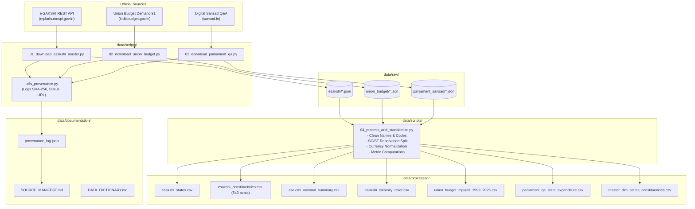

# MPLADS Data Pipeline Architecture & Operations Guide
**Project**: SIH 2026 – Member of Parliament Local Area Development Scheme (MPLADS) Data & Governance Analytics  
**Version**: 1.0.0  

---

## 1. Pipeline Architecture Overview

The ingestion and processing architecture consists of four distinct stages designed for automated execution, reproducibility, and auditability:



---

## 2. Directory Structure

```
SIH 2026/
├── MPLADS_OFFICIAL_DATA_SOURCE_INVENTORY.md   # Initial comprehensive source inventory
├── data/
│   ├── raw/                                   # Pristine original downloads (never edit manually)
│   │   ├── esakshi/                           # Live e-SAKSHI JSON responses
│   │   ├── union_budget/                      # Union Budget outlays & estimates
│   │   └── parliament_sansad/                 # Audited Q&A tabular annexures
│   ├── processed/                             # Production-ready relational CSV tables
│   │   ├── esakshi_states.csv                 # 36 States & UTs
│   │   ├── esakshi_constituencies.csv         # 543 Parliamentary Constituencies with reservation
│   │   ├── esakshi_national_summary.csv       # Macro financial & physical KPIs
│   │   ├── esakshi_calamity_relief.csv        # MP disaster relief contributions
│   │   ├── union_budget_mplads_1993_2025.csv  # 33-year longitudinal fiscal series
│   │   ├── parliament_qa_state_expenditure.csv# State-wise cumulative audited metrics
│   │   └── master_dim_states_constituencies.csv# Analytical dimension table
│   ├── scripts/                               # Reproducible ingestion and ETL scripts
│   │   ├── 01_download_esakshi_master.py      # Connects to live e-SAKSHI REST endpoints
│   │   ├── 02_download_union_budget.py        # Ingests Union Budget outlays
│   │   ├── 03_download_parliament_qa.py       # Ingests Parliamentary tabular records
│   │   ├── 04_process_and_standardize.py      # Normalizes and cleans into tabular CSVs
│   │   ├── run_all.py                         # Master runner executing the full pipeline
│   │   └── utils_provenance.py                # SHA-256 and metadata audit logger
│   └── documentation/                         # Data governance documentation
│       ├── SOURCE_MANIFEST.md                 # Provenance registry with URLs and hashes
│       ├── DATA_DICTIONARY.md                 # Complete field-level schema definitions
│       ├── PIPELINE_GUIDE.md                  # This operations guide
│       └── provenance_log.json                # Append-only JSON ledger of all acquisitions
```

---

## 3. Quick Start & Execution

### Prerequisites
- Python 3.9+ (Uses standard library modules: `urllib`, `ssl`, `json`, `csv`, `hashlib`, `re`, `pathlib`).
- No external heavy dependencies required for the base pipeline.

### Running the Entire Pipeline
Execute the master runner from the workspace root:
```bash
python3 data/scripts/run_all.py
```

### Running Individual Pipeline Stages
1. **Download e-SAKSHI Master Datasets**:
   ```bash
   python3 data/scripts/01_download_esakshi_master.py
   ```
2. **Download Union Budget Outlays**:
   ```bash
   python3 data/scripts/02_download_union_budget.py
   ```
3. **Download Parliamentary Q&A Records**:
   ```bash
   python3 data/scripts/03_download_parliament_qa.py
   ```
4. **Transform & Generate Processed CSVs**:
   ```bash
   python3 data/scripts/04_process_and_standardize.py
   ```

---

## 4. Key Operational Features

### 1. Robustness & Politeness (Exponential Backoff)
The e-SAKSHI government server is hosted on the NIC cloud. The script incorporates:
- Configurable timeouts (`timeout=35` seconds on heavy queries).
- Exponential retry backoff (`max_retries=3`) on network drops.
- A 0.6-second delay between constituency requests across 36 states to prevent HTTP 429 / 503 throttling.

### 2. Immutable Provenance Tracking (`utils_provenance.py`)
Whenever any dataset is downloaded or updated:
- The exact source URL, HTTP method, and response status are captured.
- The binary SHA-256 checksum is computed.
- The record is appended to `data/documentation/provenance_log.json`.

### 3. Data Cleansing Rules (`04_process_and_standardize.py`)
- **Constituency Reservation Extraction**: Automatically parses strings like `AMALAPURAM(SC)` to extract the reservation status (`SC`) while setting clean title-cased names (`Amalapuram`).
- **Currency Normalization**: Strips comma groupings and rupee symbols (`₹`) and provides dual columns for exact rupees (`amount_inr`) and standard crores (`amount_crores`).
- **Key Performance Indicators (KPIs)**: Automatically computes `utilization_rate_pct`, `sanction_rate_pct`, and `completion_rate_pct`.

---

## 5. Maintenance & Extensibility

- **Scheduled Updates**: To run daily or weekly updates during parliament sessions or financial year closings, schedule `python3 data/scripts/run_all.py` via a cron job or background runner.
- **Adding Micro-Level Work Data**: To expand the pipeline to download all completed work items per MP, invoke `/rest/PreLoginCitizenWorkRcmdRest/getAllCompletedWorkByMP` passing the MP IDs from `esakshi_constituencies.csv`.
