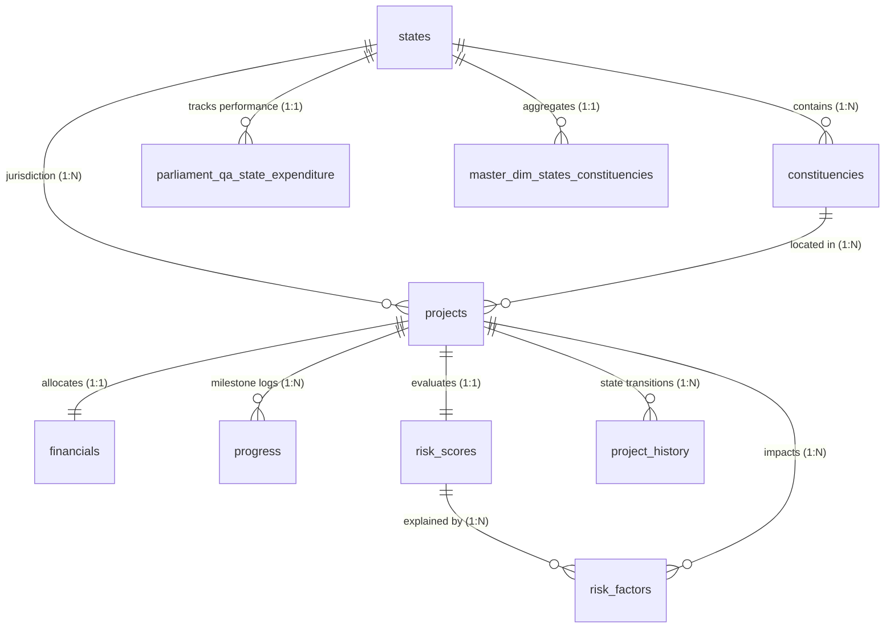

# MPLADS PostgreSQL Database Schema Reference
**Project**: SIH 2026 – Member of Parliament Local Area Development Scheme (MPLADS) Data & Governance Analytics  
**Database**: `mplads_db` (PostgreSQL 16+)  
**Version**: Phase 3 Production Release (Migrations 001, 002, 003 applied)  

---

## 1. Relational Entity-Relationship Architecture

---

## 2. Table Catalog & Column Specifications

### A. Core Dimension & Macro Series Tables

#### 1. `states`
Master dimension representing all 28 States and 8 Union Territories.
- `state_id` (INTEGER, Primary Key): Official administrative State ID (1–36).
- `state_name` (VARCHAR(100), NOT NULL): Official State/UT name.
- `category` (VARCHAR(30), NOT NULL): Classification (`'State'` or `'Union Territory'`).
- `canonical_state_key` (VARCHAR(50), UNIQUE NOT NULL): Lowercase alphanumeric lookup key (e.g. `'uttar_pradesh'`).

#### 2. `constituencies`
Master catalog of all 543 Lok Sabha parliamentary seats.
- `constituency_id` (INTEGER, Primary Key): Official constituency ID (1–543).
- `state_id` (INTEGER, NOT NULL, FK $\to$ `states(state_id)` ON DELETE RESTRICT).
- `state_name` (VARCHAR(100), NOT NULL).
- `constituency_name` (VARCHAR(150), NOT NULL).
- `raw_caption` (VARCHAR(200), NOT NULL): e-Sakshi portal raw display text.
- `reservation_category` (VARCHAR(20), NOT NULL): Caste reservation category (`'General'`, `'SC'`, `'ST'`).
- `canonical_state_key` (VARCHAR(50), NOT NULL).

#### 3. `national_summary`
National scheme summary metrics published by MoSPI.
- `metric_key` (VARCHAR(50), Primary Key): Standardized identifier (`'works_recommended'`, `'funds_released'`, etc.).
- `metric_description` (VARCHAR(150), NOT NULL).
- `count_works` (BIGINT, NULL): Count of developmental works (NULL for monetary limit tiles).
- `amount_inr` (NUMERIC(18, 2), NOT NULL CHECK $\ge 0$).
- `amount_crores` (NUMERIC(12, 2), NOT NULL CHECK $\ge 0$).

#### 4. `calamity_relief`
Itemized Member of Parliament disaster relief contributions under Paragraph 3.12 of the MPLADS Guidelines.
- `s_no` (INTEGER, Primary Key): Serial identifier.
- `honorific` (VARCHAR(20), NULL): Extracted prefix (`'Shri'`, `'Smt.'`, `'Dr.'`).
- `mp_name` (VARCHAR(150), NOT NULL).
- `house_of_parliament` (VARCHAR(30), NOT NULL CHECK IN (`'Lok Sabha'`, `'Rajya Sabha'`)).
- `tenure` (VARCHAR(50), NOT NULL).
- `calamity_name` (VARCHAR(200), NOT NULL): Identified natural disaster event.
- `calamity_type` (VARCHAR(50), NOT NULL CHECK IN (`'National Calamity'`, `'State Calamity'`)).
- `consented_amount_inr` (NUMERIC(14, 2), NOT NULL CHECK $\ge 0$).
- `consented_amount_lakhs` (NUMERIC(10, 2), NOT NULL CHECK $\ge 0$ AND $\le 100.00$ statutory cap).
- `consent_date_iso` (DATE, NOT NULL).
- `tenure_start_date_iso` (DATE, NOT NULL).
- `tenure_end_date_iso` (DATE, NOT NULL).

#### 5. `union_budget`
33-year longitudinal fiscal series (1993–2025) of Demand No. 91 allocations.
- `financial_year` (VARCHAR(10), Primary Key CHECK `~ '^\d{4}-\d{2}$'`).
- `start_year` (INTEGER, NOT NULL).
- `end_year` (INTEGER, NOT NULL).
- `scheme_entitlement_per_mp_cr` (NUMERIC(6, 2), NOT NULL).
- `budget_estimate_cr` (NUMERIC(10, 2), NOT NULL CHECK $\ge 0$).
- `revised_estimate_cr` (NUMERIC(10, 2), NULL CHECK $\ge 0$).
- `actual_expenditure_cr` (NUMERIC(10, 2), NULL CHECK $\ge 0$).
- `be_vs_actual_variance_cr` (NUMERIC(10, 2), NULL): `Actual - BE`.
- `major_head` (INTEGER, NOT NULL DEFAULT 3475).
- `status_notes` (TEXT, NOT NULL).

#### 6. `parliament_qa_state_expenditure`
Audited state-wise fiscal allocations, expenditures, and physical workflow progress.
- `state_id` (INTEGER, Primary Key).
- `state_name` (VARCHAR(100), NOT NULL).
- `canonical_state_key` (VARCHAR(50), NOT NULL, FK $\to$ `states(canonical_state_key)`).
- `entitlement_cr` (NUMERIC(10, 2), NOT NULL CHECK $\ge 0$).
- `released_cr` (NUMERIC(10, 2), NOT NULL CHECK $\ge 0$).
- `expenditure_cr` (NUMERIC(10, 2), NOT NULL CHECK $\ge 0$).
- `unspent_balance_cr` (NUMERIC(10, 2), NOT NULL).
- `utilization_rate_pct` (NUMERIC(6, 2), NOT NULL CHECK $\ge 0$ AND $\le 100$).
- `works_recommended` (INTEGER, NOT NULL CHECK $\ge 0$).
- `works_sanctioned` (INTEGER, NOT NULL CHECK $\ge 0$).
- `works_completed` (INTEGER, NOT NULL CHECK $\ge 0$).
- `sanction_rate_pct` (NUMERIC(6, 2), NOT NULL).
- `completion_rate_pct` (NUMERIC(6, 2), NOT NULL).
- `is_utilization_valid` (BOOLEAN, NOT NULL).
- `is_workflow_valid` (BOOLEAN, NOT NULL).

#### 7. `master_dim_states_constituencies`
Integrated master analytical dimension.
- `state_id` (INTEGER, Primary Key, FK $\to$ `states(state_id)`).
- `state_name` (VARCHAR(100), NOT NULL).
- `canonical_state_key` (VARCHAR(50), NOT NULL, FK $\to$ `states(canonical_state_key)`).
- `category` (VARCHAR(30), NOT NULL).
- `total_lok_sabha_seats` (INTEGER, NOT NULL).
- `general_seats` (INTEGER, NOT NULL).
- `sc_reserved_seats` (INTEGER, NOT NULL).
- `st_reserved_seats` (INTEGER, NOT NULL).
- `sc_seat_share_pct` (NUMERIC(5, 2), NOT NULL).
- `st_seat_share_pct` (NUMERIC(5, 2), NOT NULL).
- `statutory_sc_allocation_pct` (NUMERIC(4, 2), NOT NULL DEFAULT 15.00).
- `statutory_st_allocation_pct` (NUMERIC(4, 2), NOT NULL DEFAULT 7.50).
- `cumulative_released_cr` (NUMERIC(12, 2), NOT NULL CHECK $\ge 0$).
- `cumulative_expenditure_cr` (NUMERIC(12, 2), NOT NULL CHECK $\ge 0$).
- `unspent_balance_cr` (NUMERIC(12, 2), NOT NULL).
- `utilization_pct` (NUMERIC(5, 2), NOT NULL).
- `works_completed_count` (INTEGER, NOT NULL).

---

### B. Project Microdata & Operational Tables

#### 8. `projects`
Work-level master table tracking individual developmental projects recommended by MPs.
- `project_id` (VARCHAR(64), Primary Key): Unique alphanumeric ID (e.g. `'MPLADS-2024-0001'`).
- `project_code` (VARCHAR(64), UNIQUE NOT NULL): Official code (e.g. `'PRJ-10-141-001'`).
- `project_title` (VARCHAR(255), NOT NULL).
- `project_description` (TEXT, NULL).
- `sector` (VARCHAR(100), NOT NULL): Developmental sector (`'Drinking Water'`, `'Education'`, `'Health'`, `'Sanitation'`, `'Roads & Bridges'`, `'Electricity'`, `'Community Infrastructure'`, `'Irrigation'`).
- `sub_sector` (VARCHAR(100), NULL).
- `state_id` (INTEGER, NOT NULL, FK $\to$ `states(state_id)` ON DELETE RESTRICT).
- `constituency_id` (INTEGER, NOT NULL, FK $\to$ `constituencies(constituency_id)` ON DELETE RESTRICT).
- `district_name` (VARCHAR(100), NOT NULL).
- `block_name` (VARCHAR(100), NULL).
- `implementing_agency` (VARCHAR(150), NOT NULL).
- `mp_name` (VARCHAR(150), NOT NULL).
- `house_of_parliament` (VARCHAR(30), NOT NULL CHECK IN (`'Lok Sabha'`, `'Rajya Sabha'`)).
- `financial_year` (VARCHAR(10), NOT NULL CHECK `~ '^\d{4}-\d{2}$'`).
- `current_status` (VARCHAR(30), NOT NULL DEFAULT `'Recommended'` CHECK IN (`'Recommended'`, `'Sanctioned'`, `'Work Order Issued'`, `'In Progress'`, `'Completed'`, `'Cancelled'`, `'Stalled'`)).
- `recommendation_date` (DATE, NOT NULL).
- `sanction_date` (DATE, NULL CHECK `sanction_date >= recommendation_date`).
- `work_order_date` (DATE, NULL CHECK `work_order_date >= sanction_date`).
- `expected_completion_date` (DATE, NULL).
- `actual_completion_date` (DATE, NULL CHECK `actual_completion_date >= work_order_date`).
- `search_vector` (TSVECTOR, GENERATED ALWAYS AS FTS vector over text attributes).
- `created_at` (TIMESTAMPTZ, NOT NULL DEFAULT CURRENT_TIMESTAMP).
- `updated_at` (TIMESTAMPTZ, NOT NULL DEFAULT CURRENT_TIMESTAMP).

#### 9. `financials`
Granular financial allocation, disbursement, expenditure, and variance accounting per project.
- `financial_id` (BIGSERIAL, Primary Key).
- `project_id` (VARCHAR(64), UNIQUE NOT NULL, FK $\to$ `projects(project_id)` ON DELETE CASCADE).
- `currency` (VARCHAR(10), NOT NULL DEFAULT `'INR'`).
- `recommended_amount` (NUMERIC(14, 2), NOT NULL CHECK $\ge 0$).
- `sanctioned_amount` (NUMERIC(14, 2), NULL CHECK $\ge 0$).
- `released_amount` (NUMERIC(14, 2), NOT NULL DEFAULT 0.00 CHECK $\ge 0$).
- `expenditure_amount` (NUMERIC(14, 2), NOT NULL DEFAULT 0.00 CHECK $\ge 0$).
- `unspent_balance` (NUMERIC(14, 2), GENERATED ALWAYS AS `(released_amount - expenditure_amount)` STORED).
- `utilization_rate_pct` (NUMERIC(6, 2), NULL CHECK $\ge 0$ AND $\le 100$).
- `cost_overrun_amount` (NUMERIC(14, 2), NOT NULL DEFAULT 0.00 CHECK $\ge 0$).
- `cost_overrun_pct` (NUMERIC(6, 2), NOT NULL DEFAULT 0.00 CHECK $\ge 0$).
- `last_disbursement_date` (DATE, NULL).
- `created_at` / `updated_at` (TIMESTAMPTZ).

#### 10. `progress`
Chronological physical execution updates, milestone tracking, and geo-tagged audit verifications.
- `progress_id` (BIGSERIAL, Primary Key).
- `project_id` (VARCHAR(64), NOT NULL, FK $\to$ `projects(project_id)` ON DELETE CASCADE).
- `reported_date` (DATE, NOT NULL).
- `physical_progress_pct` (NUMERIC(5, 2), NOT NULL DEFAULT 0.00 CHECK $\ge 0.00$ AND $\le 100.00$).
- `financial_progress_pct` (NUMERIC(5, 2), NOT NULL DEFAULT 0.00 CHECK $\ge 0.00$ AND $\le 100.00$).
- `current_stage` (VARCHAR(50), NOT NULL CHECK IN (`'Feasibility'`, `'Tendering'`, `'Contract Awarded'`, `'Foundation'`, `'Structure'`, `'Finishing'`, `'Inspection'`, `'Commissioned'`, `'Completed'`)).
- `days_delayed` (INTEGER, NOT NULL DEFAULT 0 CHECK $\ge 0$).
- `milestone_status` (VARCHAR(30), NOT NULL DEFAULT `'On Track'` CHECK IN (`'On Track'`, `'Delayed'`, `'Critical'`, `'Completed'`)).
- `inspected_by` (VARCHAR(150), NULL).
- `inspection_date` (DATE, NULL).
- `inspection_remarks` (TEXT, NULL).
- `geo_latitude` (NUMERIC(10, 7), NULL CHECK $\ge 6.0$ AND $\le 38.0$).
- `geo_longitude` (NUMERIC(10, 7), NULL CHECK $\ge 68.0$ AND $\le 98.0$).
- `photo_evidence_url` (VARCHAR(255), NULL).
- `created_at` (TIMESTAMPTZ).
- **Constraint**: `CONSTRAINT uq_progress_project_date UNIQUE (project_id, reported_date)`.

#### 11. `risk_scores`
Predictive risk assessment outputs evaluating project delay, cost overrun, and completion feasibility.
- `risk_score_id` (BIGSERIAL, Primary Key).
- `project_id` (VARCHAR(64), UNIQUE NOT NULL, FK $\to$ `projects(project_id)` ON DELETE CASCADE).
- `overall_risk_score` (NUMERIC(5, 2), NOT NULL CHECK $\ge 0.00$ AND $\le 100.00$).
- `delay_risk_score` (NUMERIC(5, 2), NOT NULL CHECK $\ge 0.00$ AND $\le 100.00$).
- `cost_overrun_risk_score` (NUMERIC(5, 2), NOT NULL CHECK $\ge 0.00$ AND $\le 100.00$).
- `non_completion_risk_score` (NUMERIC(5, 2), NOT NULL CHECK $\ge 0.00$ AND $\le 100.00$).
- `leakage_risk_score` (NUMERIC(5, 2), NOT NULL CHECK $\ge 0.00$ AND $\le 100.00$).
- `risk_level` (VARCHAR(20), NOT NULL CHECK IN (`'Low'`, `'Moderate'`, `'High'`, `'Critical'`)).
- `confidence_score` (NUMERIC(4, 3), NOT NULL CHECK $\ge 0.000$ AND $\le 1.000$).
- `assessment_date` (DATE, NOT NULL).
- `model_version` (VARCHAR(50), NOT NULL DEFAULT `'v1.0'`).
- `created_at` (TIMESTAMPTZ).
- **Constraint**: `CONSTRAINT uq_risk_scores_project UNIQUE (project_id)`.

#### 12. `risk_factors`
Granular causal drivers, weights, and mitigation recommendations.
- `factor_id` (BIGSERIAL, Primary Key).
- `risk_score_id` (BIGINT, NOT NULL, FK $\to$ `risk_scores(risk_score_id)` ON DELETE CASCADE).
- `project_id` (VARCHAR(64), NOT NULL, FK $\to$ `projects(project_id)` ON DELETE CASCADE).
- `factor_category` (VARCHAR(50), NOT NULL CHECK IN (`'Agency Past Performance'`, `'Delay in Tendering'`, `'Budget Gap'`, `'Slow Physical Pace'`, `'Monsoon Seasonality'`, `'Geographic Remoteness'`, `'Land Dispute'`, `'Contractor Inaction'`, `'Other'`)).
- `factor_name` (VARCHAR(150), NOT NULL).
- `factor_weight` (NUMERIC(4, 3), NOT NULL CHECK $\ge 0.000$ AND $\le 1.000$).
- `factor_impact` (VARCHAR(20), NOT NULL CHECK IN (`'Low'`, `'Medium'`, `'High'`, `'Critical'`)).
- `mitigation_recommendation` (TEXT, NOT NULL).
- `is_mitigated` (BOOLEAN, NOT NULL DEFAULT FALSE).
- `created_at` (TIMESTAMPTZ).
- **Constraint**: `CONSTRAINT uq_risk_factors_score_factor UNIQUE (risk_score_id, factor_name)`.

#### 13. `project_history`
Immutable temporal audit ledger recording state transitions and administrative events.
- `history_id` (BIGSERIAL, Primary Key).
- `project_id` (VARCHAR(64), NOT NULL, FK $\to$ `projects(project_id)` ON DELETE CASCADE).
- `event_type` (VARCHAR(50), NOT NULL CHECK IN (`'Created'`, `'Sanctioned'`, `'Tender Floated'`, `'Work Order Issued'`, `'Fund Disbursed'`, `'Milestone Reached'`, `'Inspection Passed'`, `'Delay Flagged'`, `'Cost Revised'`, `'Completed'`, `'Cancelled'`, `'Status Changed'`)).
- `previous_status` (VARCHAR(30), NULL).
- `new_status` (VARCHAR(30), NOT NULL).
- `event_timestamp` (TIMESTAMPTZ, NOT NULL DEFAULT CURRENT_TIMESTAMP).
- `performed_by` (VARCHAR(100), NOT NULL).
- `event_description` (TEXT, NOT NULL).
- `metadata_json` (JSONB, NULL).
- **Constraint**: `CONSTRAINT uq_history_project_event_time UNIQUE (project_id, event_type, event_timestamp)`.

---

## 3. Analytical Views Catalog

1. **`v_project_overview`**: 50-attribute unified view combining master attributes, financial accounting, latest progress, and risk scores with derived boolean flags (`is_delayed`, `has_cost_overrun`, `audit_status`).
2. **`v_delayed_projects`**: Real-time operational surveillance prioritizing stalled or delayed projects by days delayed and delay risk score.
3. **`v_high_risk_projects`**: Risk governance view isolating vulnerable works ($\text{score} \ge 40$) and aggregating contributing causal factors into structured JSON.
4. **`v_projects_missing_information`**: Quality assurance view auditing missing dates, pending inspections, and incomplete geo-coordinates.
5. **`v_sector_financial_summary`**: Aggregates projects, completion counts, allocations, spend, utilization percentage, and delay counts by developmental sector.
6. **`v_state_equity_analysis`**: SC/ST statutory quota compliance assessment across all 36 States/UTs.
7. **`v_state_efficiency_ranking`**: Ranks States and UTs across utilization and completion rates.
8. **`v_budget_historical_performance`**: 33-year Union Budget performance analysis.
